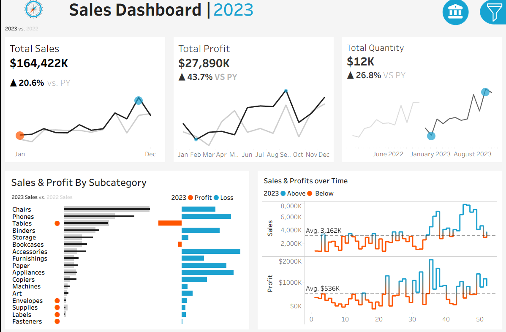

# 📊 Sales Performance Dashboard | Tableau

## Project Overview

Developed an interactive Tableau dashboard to analyze sales performance across products, categories, regions, and time periods. The dashboard provides key business insights through dynamic visualizations and interactive filters, helping users monitor performance and support data-driven decision-making.

---

## Dashboard Preview



---
## Business Problem

Businesses generate large volumes of sales data, making it difficult to monitor performance and identify trends through raw spreadsheets alone. This dashboard provides a centralized view of key sales metrics, enabling users to evaluate regional performance, product profitability, and sales trends to support informed business decisions.
---

## Key Performance Indicators (KPIs)

*  Total Sales
*  Total Profit
*  Total Quantity
*  Sales and Profits by category
*  Sales and Profit Trends over the years

---

## Dashboard Features

* Interactive filters for customized analysis
* Sales trend analysis over time
* Category and sub-category performance analysis
* Business performance overview
* Clean, interactive, and user-friendly dashboard design

---

## Dataset

The dashboard is built using the following datasets:

* **Orders.csv**
* **Customers.csv**
* **Products.csv**
* **Location.csv**

These datasets were connected and modeled in Tableau to create a unified sales analysis dashboard.

---
## Tools & Technologies

- **Visualization:** Tableau
- **Data Source:** CSV Files
- **Data Preparation:** Data Cleaning, Data Transformation
- **Techniques:** Dashboard Design, KPI Analysis, Interactive Filtering
---

## Skills Demonstrated

- Data Cleaning
- Data Visualization
- Dashboard Development
- KPI Analysis
- Business Intelligence
- Trend Analysis
- Interactive Dashboard Design
- Data Storytelling

## Key Business Insights

The dashboard enables users to:

- Evaluate sales and profitability across different categories to identify top-performing markets.
- Compare product categories and sub-categories to understand revenue and profit contribution.
- Monitor sales trends over time to identify seasonal patterns and business growth.
- Identify underperforming products that may require business attention.
---

## Repository Structure

```text
Sales Dashboard/
│
├── Sales Dashboard Project.twbx
├── Customers.csv
├── Orders.csv
├── Products.csv
├── Location.csv
├── sales dashboard.png
└── README.md
```

---

## How to Use

1. Clone or download this repository.
2. Open **Sales Dashboard Project.twbx** using Tableau Desktop or Tableau Public.
3. If prompted, reconnect the workbook to the provided CSV files.
4. Explore the dashboard using the available interactive filters and visualizations.

---

## Project Highlights

* Interactive Tableau dashboard
* Multiple KPIs for business monitoring
* Sales and profit analysis
* Product category insights
* Clean and intuitive dashboard layout

---

## Author

**Nakka Bhaskar Gangadhar**

- GitHub: https://github.com/bhaskar-nb
- LinkedIn: https://www.linkedin.com/in/bhaskar-nakka-43a701259/
- Tableau Public: https://public.tableau.com/app/profile/bhaskar.nakka4980

---

If you found this project useful, consider giving it a ⭐.
